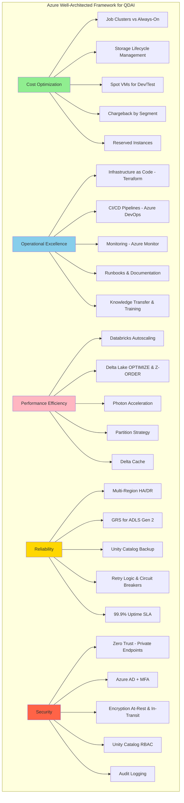
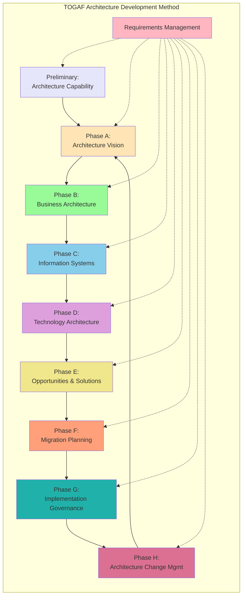
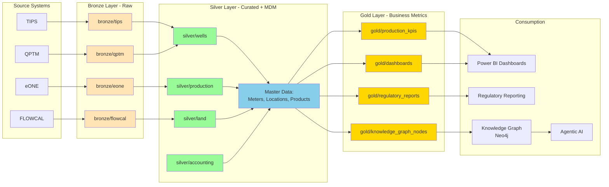
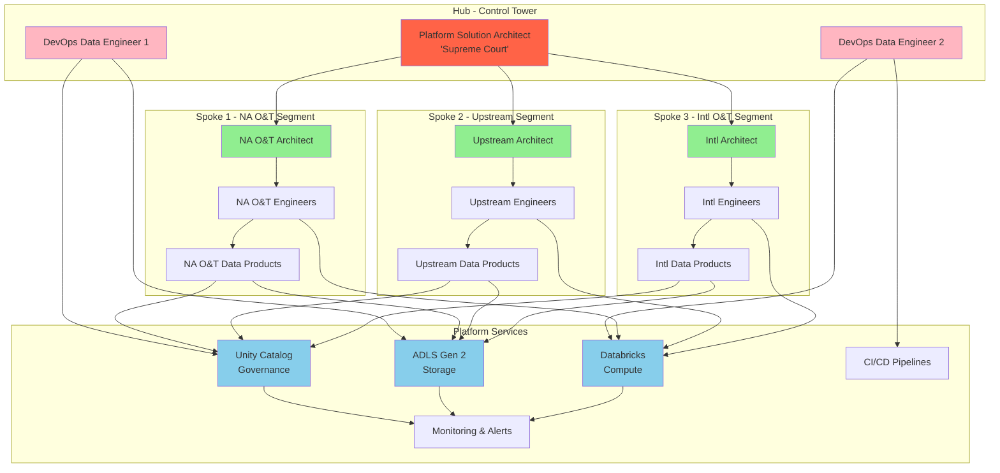
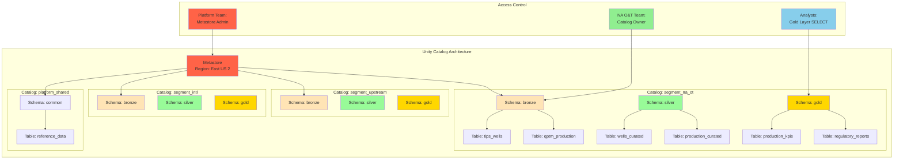
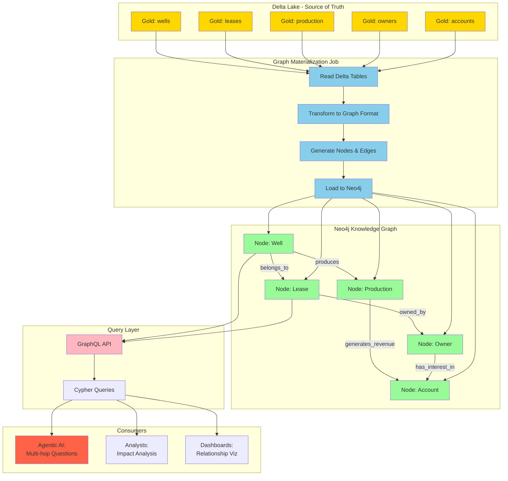
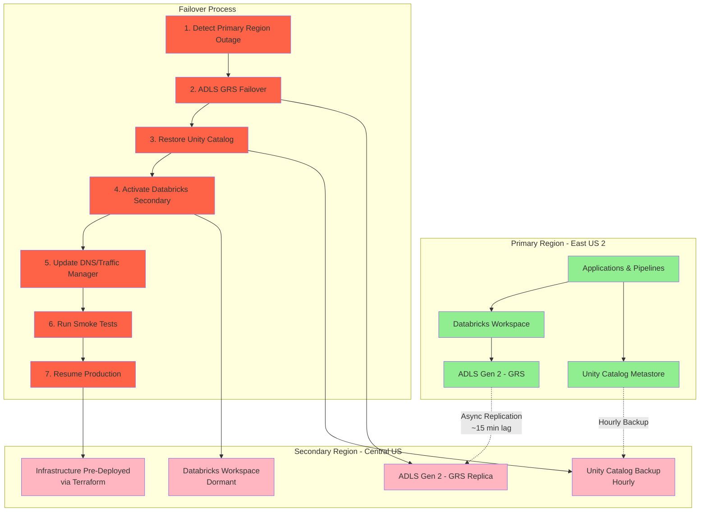
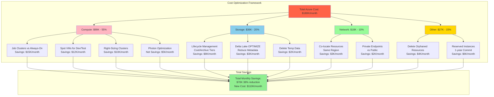
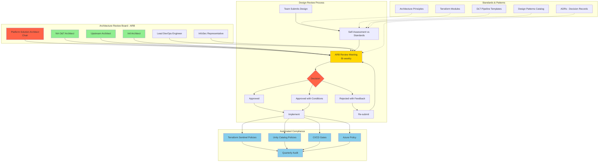

# Visual Architecture Diagrams
## Quorum Data & AI Platform (QDAI)

This document contains architecture diagrams to help visualize key concepts for the interview. These diagrams are in Mermaid format and can be rendered in most markdown viewers or converted to images.

---

## Diagram 1: Azure Well-Architected Framework Applied to QDAI



**How to Use in Interview**: "Let me walk you through how I'd apply the 5 pillars of Azure WAF to QDAI..."

---

## Diagram 2: TOGAF ADM Phases for QDAI



**QDAI Application**:
- **Preliminary**: Establish ARB, architecture principles
- **Phase A**: Hub-and-Spoke vision, stakeholder buy-in
- **Phase B**: Business capabilities (Ingestion, Transformation, Governance, Consumption, AI/ML)
- **Phase C**: Medallion Architecture, Unity Catalog, Knowledge Graph
- **Phase D**: Azure + Databricks + ADLS Gen 2 + Neo4j
- **Phase E**: 4-phase implementation roadmap (Foundation → Pilot → Scale → Innovate)
- **Phase F**: Phased migration (domain by domain, parallel run)
- **Phase G**: ARB design reviews, compliance checks
- **Phase H**: Continuous monitoring, change requests, technology radar

---

## Diagram 3: Medallion Architecture (Bronze → Silver → Gold)



**Key Points**:
- **Bronze**: Immutable, raw, append-only (audit trail)
- **Silver**: Cleansed, conformed, MDM-enriched (single source of truth)
- **Gold**: Business-ready, pre-aggregated, semantic layer

---

## Diagram 4: Hub-and-Spoke Operating Model



**Key Points**:
- **Hub (Control Tower)**: Platform team provides shared services, sets standards, enforces guardrails
- **Spokes (Segment Teams)**: Build data products within platform guardrails, autonomy with governance
- **Platform Services**: Unity Catalog, ADLS, Databricks, CI/CD, Monitoring (shared by all segments)

---

## Diagram 5: Unity Catalog Hierarchy for QDAI



**Key Points**:
- **Catalog per Segment**: Strong isolation, autonomy, chargeback visibility
- **Schemas by Layer**: Bronze, Silver, Gold within each catalog
- **Access Control**: Platform team (Metastore admin), Segment teams (Catalog owners), Analysts (Gold layer read-only)

---

## Diagram 6: Knowledge Graph Architecture



**Key Points**:
- **Delta Lake = Source of Truth**: Gold layer tables are authoritative
- **Graph = Specialized Index**: Optimized for relationship traversal
- **Materialization**: Scheduled job (nightly/hourly) syncs Delta → Neo4j
- **Query Layer**: GraphQL API abstracts Cypher complexity
- **Consumers**: Agentic AI, impact analysis, relationship visualization

---

## Diagram 7: Disaster Recovery Multi-Region Architecture



**Key Metrics**:
- **RTO**: 4 hours (Recovery Time Objective)
- **RPO**: 1 hour (Recovery Point Objective - GRS lag ~15 min, Unity Catalog backup hourly)
- **Cost**: +12% (secondary region infrastructure dormant, GRS +50% on storage)
- **Testing**: Quarterly DR drills in non-prod, annual prod failover

---

## Diagram 8: CI/CD Pipeline for Data Platform

```mermaid
graph LR
    subgraph "Source Control"
        GIT[Git Repository<br/>Azure DevOps Repos]
        BR1[Branch: main]
        BR2[Branch: develop]
        BR3[Branch: feature/na-pipeline]
    end

    subgraph "CI Pipeline - Build & Test"
        BUILD[Build Artifacts]
        LINT[Lint: black, flake8]
        TEST[Unit Tests: pytest]
        SCAN[Security Scan]
        PACKAGE[Package: wheels, notebooks]
    end

    subgraph "CD Pipeline - Deploy"
        DEPLOY_DEV[Deploy to Dev]
        SMOKE_DEV[Smoke Tests]
        DEPLOY_TEST[Deploy to Test]
        INT_TEST[Integration Tests]
        APPROVAL[Manual Approval Gate]
        DEPLOY_PROD[Deploy to Prod]
        SMOKE_PROD[Smoke Tests Prod]
    end

    subgraph "Environments"
        ENV_DEV[Dev Databricks Workspace]
        ENV_TEST[Test Databricks Workspace]
        ENV_PROD[Prod Databricks Workspace]
    end

    BR3 --> GIT
    GIT -->|PR Merge to develop| BR2
    BR2 --> BUILD

    BUILD --> LINT
    LINT --> TEST
    TEST --> SCAN
    SCAN --> PACKAGE

    PACKAGE --> DEPLOY_DEV
    DEPLOY_DEV --> ENV_DEV
    ENV_DEV --> SMOKE_DEV

    SMOKE_DEV -->|Auto-Deploy| DEPLOY_TEST
    DEPLOY_TEST --> ENV_TEST
    ENV_TEST --> INT_TEST

    INT_TEST --> APPROVAL

    BR2 -->|PR Merge to main| BR1
    BR1 --> APPROVAL
    APPROVAL -->|Approved| DEPLOY_PROD
    DEPLOY_PROD --> ENV_PROD
    ENV_PROD --> SMOKE_PROD

    style GIT fill:#FFE4B5
    style BUILD fill:#87CEEB
    style LINT fill:#87CEEB
    style TEST fill:#87CEEB
    style SCAN fill:#87CEEB
    style DEPLOY_DEV fill:#98FB98
    style DEPLOY_TEST fill:#FFD700
    style APPROVAL fill:#FF6347
    style DEPLOY_PROD fill:#FF6347
```



**Key Points**:
- **Git Workflow**: Feature → Develop → Main (no direct commits to main)
- **CI**: Lint, test, scan on every PR
- **CD**: Auto-deploy to dev/test, manual approval for prod
- **Infrastructure as Code**: Terraform in same pipeline for infra changes

---

## Diagram 9: Cost Optimization Strategies



**Key Message**: "I achieved 38% cost reduction through systematic optimization across compute, storage, networking, using Azure WAF Cost Optimization best practices."

---

## Diagram 10: Architecture Governance Model (TOGAF)



**Key Points**:
- **ARB**: Cross-functional board reviews designs (not a bottleneck - guardrails)
- **Process**: Submit → Self-assess → Review → Decision (5 business days)
- **Automated Compliance**: Most governance automated (not manual gates)
- **Standards**: Reusable components accelerate teams

---

## How to Use These Diagrams in Interview

### Approach 1: Draw on Whiteboard
- If interview is in-person or virtual with whiteboard sharing
- Practice drawing key diagrams from memory (Medallion Architecture, Hub-and-Spoke, Unity Catalog)
- Don't need perfect diagrams - clarity of thinking matters more than artistic skill

### Approach 2: Reference Verbally
- "Let me walk you through the architecture using the Azure WAF pillars..." (refer to Diagram 1)
- "Our Hub-and-Spoke model works like this..." (refer to Diagram 4)
- "The Knowledge Graph sits on top of Delta Lake..." (refer to Diagram 6)

### Approach 3: Bring Printed Version
- Print 2-3 key diagrams (Medallion Architecture, Hub-and-Spoke, Unity Catalog)
- Refer to them during discussion
- Offer to leave copies with interviewers

### Approach 4: Share Screen (Virtual Interview)
- Open this markdown file in a viewer that renders Mermaid diagrams
- Share screen when explaining architecture concepts
- Walk through diagrams step-by-step

---

## Quick Diagram Reference

| Interview Question | Use This Diagram |
|-------------------|------------------|
| "How would you apply Azure WAF to QDAI?" | Diagram 1: Azure WAF |
| "Walk me through your approach using TOGAF" | Diagram 2: TOGAF ADM |
| "Explain the Medallion Architecture" | Diagram 3: Medallion Architecture |
| "How does Hub-and-Spoke work?" | Diagram 4: Hub-and-Spoke Model |
| "Explain Unity Catalog for multi-tenancy" | Diagram 5: Unity Catalog Hierarchy |
| "How does the Knowledge Graph work?" | Diagram 6: Knowledge Graph Architecture |
| "Describe your DR strategy" | Diagram 7: DR Multi-Region |
| "How do you implement CI/CD for data pipelines?" | Diagram 8: CI/CD Pipeline |
| "How would you reduce costs?" | Diagram 9: Cost Optimization |
| "Explain your governance model" | Diagram 10: Architecture Governance |

---

## Converting Diagrams to Images

If you need actual image files (.png):

1. **Online Mermaid Editor**:
   - Go to https://mermaid.live/
   - Paste Mermaid code
   - Export as PNG/SVG

2. **VS Code Extension**:
   - Install "Markdown Preview Mermaid Support" extension
   - Preview this file, right-click diagram, "Copy as Image"

3. **Command-Line**:
   ```bash
   npm install -g @mermaid-js/mermaid-cli
   mmdc -i visual_diagrams.md -o diagrams.pdf
   ```

---

## Practice Tip

**Before the interview**:
1. Pick 3-4 diagrams most relevant to QDAI (Medallion, Hub-and-Spoke, Unity Catalog, Knowledge Graph)
2. Practice drawing them from memory on a whiteboard or paper
3. Practice explaining each component while drawing
4. Aim for clarity, not perfection

**During the interview**:
- Use diagrams to structure your answers (visual thinking)
- Draw simple boxes and arrows (don't worry about aesthetics)
- Label clearly
- Walk interviewer through step-by-step

---

Good luck! 🚀
